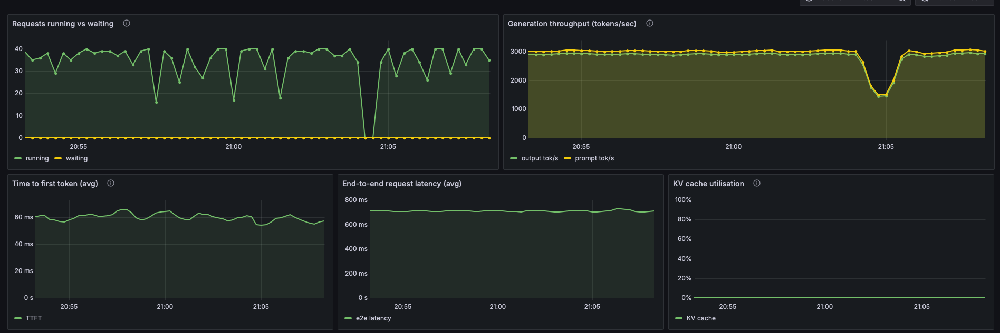

# FinReason — Financial QA Fine-Tuning with DPO Alignment

Post-training pipeline for financial numerical reasoning: QLoRA SFT → DPO alignment →
AWQ 4-bit compression → vLLM serving, evaluated end to end on FinQA's official test set.

**Models on HuggingFace:**
[finreason-qwen2.5-7b-dpo](https://huggingface.co/glen-louis/finreason-qwen2.5-7b-dpo) (LoRA adapter) ·
[finreason-qwen2.5-7b-awq](https://huggingface.co/glen-louis/finreason-qwen2.5-7b-awq) (merged, AWQ 4-bit)

---

## Results

Official FinQA test set, 1,147 examples. Numeric exact match, ±1% relative tolerance.

| Stage | Accuracy | Correct | Perplexity |
|-------|----------|---------|------------|
| Base (Qwen2.5-7B-Instruct, zero-shot) | 52.2% | 599/1147 | 6.60 |
| SFT (QLoRA fine-tuned) | 58.0% | 665/1147 | **2.87** |
| DPO (aligned) | **59.2%** | 679/1147 | 2.89 |

- **Perplexity drop:** 6.60 → 2.87 (base → SFT)
- **Accuracy gain:** +5.8pp from SFT, +1.2pp from DPO
- **DPO win rate vs SFT:** 0.630 — but on only 27 contested examples (17/27),
  so the DPO delta is **not statistically significant** (exact binomial p = 0.25,
  95% CI [0.42, 0.81]). DPO did not hurt; the evidence isn't strong enough to
  claim it helped.

Reference point: FinQANet (the FinQA paper's retriever-generator baseline) reports 61.24%
execution accuracy on the same test set.

Raw numbers in [`results/eval_20260805_210727.json`](results/eval_20260805_210727.json).

### What the base number is really measuring

An earlier run reported base accuracy at **0.3%**, making the headline gain look like +58pp.
That was wrong. The answer parser required a literal `Final Answer:` line, which SFT teaches
but the base model was never told to produce — so the base stage was scored on formatting,
not reasoning. Adding a fallback chain (`Final Answer:` → `the answer is X` → last number
in the response) moved base from 0.3% to 52.2% and cut the headline gain to +7pp.

The smaller number is the true one. The same parser bug also silently broke DPO pair mining:
ground truth failed to parse, `is_correct` was permanently `False`, and every sampled run got
labelled "rejected" regardless of correctness — so the first DPO run trained on pairs with no
preference signal.

---

## Compression & serving

The DPO adapter merged into the base, AWQ-quantized to 4-bit (calibrated on 256 FinQA examples
rather than a generic corpus), and served with vLLM on a rented A40.

| | Weights | Accuracy | Notes |
|---|---|---|---|
| NF4 4-bit + adapter | 15 GB base | **59.2%** | offline eval path |
| AWQ 4-bit merged | **5.2 GB** | 55.1% | served model |

**AWQ cost 4.1pp** (679 → 631 of 1147). Verified this wasn't a decoding artifact by re-running
with vLLM's inherited `repetition_penalty=1.05` disabled — 55.10% vs 55.01%, a one-example
difference, so the gap is quantization and merge, not sampling settings.

Note both figures are 4-bit; an fp16 baseline was never measured, so this compares two
quantization schemes rather than "quantized vs full precision."

### Load test — real generation, not a static endpoint

Locust against `/v1/chat/completions` with real FinQA prompts (SEC tables + questions):

| Concurrency | req/s | p50 | p95 | p99 | Failures |
|---|---|---|---|---|---|
| 10 users | 3.95 | 480 ms | 1100 ms | 1500 ms | 0 / 650 |
| 50 users | **18.95** | 440 ms | 850 ms | 1500 ms | 0 / 3337 |

5x the load, 4.8x the throughput, and p50 *dropped* — vLLM's continuous batching absorbing
concurrency rather than queueing it. Server reported 37.2 GiB of KV cache (696k tokens,
~170 concurrent 4k-token requests), so 50 users never approached saturation.

An earlier version of this README claimed 326 req/s at p99 14 ms. That load test hit an nginx
placeholder, not the model. The numbers above are the model actually generating.

### Observability

vLLM exposes Prometheus metrics; `serving/monitoring/setup_monitoring.sh` stands up Prometheus +
Grafana against a running server in one command, with the data source and dashboard provisioned
from files ([`grafana_dashboard.json`](serving/monitoring/grafana_dashboard.json)).



Measured at 40 concurrent requests on an A40:

| Metric | Value |
|---|---|
| Generation throughput | ~3,000 tok/s |
| Time to first token | ~60 ms |
| End-to-end latency | ~700 ms |
| Requests waiting | 0 (scheduler never queued) |
| KV cache utilisation | 0.3% of 645k tokens |
| Prefix cache hit rate | 87.3% |

Two caveats on those last two: the load generator repeats one short prompt, so KV usage is far
below what full SEC-table prompts would demand, and the prefix hit rate is flattered by that
repetition. Real FinQA traffic would push cache usage up and hit rate down.

`serving/monitoring/capture_metrics.py --load N` scrapes the same metrics to JSON without the
Grafana stack — useful when the box is temporary, since the JSON outlives it.

---

## Dataset

[FinQA](https://github.com/czyssrs/FinQA) — multi-step numerical reasoning over SEC earnings reports.
Questions require arithmetic over financial tables (revenue growth, margins, YoY changes).

Official 3-way split, used as published:

| Split | N | Use |
|-------|---|-----|
| train | 6,251 | SFT + DPO pair mining |
| dev | 883 | per-epoch validation, best-checkpoint selection |
| test | 1,147 | reported metrics only |

---

## Pipeline

```
prepare_data.py            → download FinQA, format for SFT, mine DPO preference pairs
train_sft.py               → QLoRA SFT on Qwen2.5-7B-Instruct
train_dpo.py               → DPO alignment on SFT checkpoint
evaluate.py                → 3-stage offline eval: base → SFT → DPO
push_to_hub.py             → publish adapter to HuggingFace

serving/model/quantize_awq.py       → merge adapter, AWQ 4-bit, push to Hub
eval_endpoint.py                    → score the live vLLM endpoint on the test set
serving/loadtest/locustfile.py      → load test with real FinQA prompts
serving/monitoring/capture_metrics.py → scrape vLLM Prometheus metrics under load
```

---

## Tests

```bash
pytest        # 30 tests, ~2s, CPU only
```

Runs in CI on every push ([`.github/workflows/tests.yml`](.github/workflows/tests.yml)).
No model loading — GPU eval costs money and doesn't belong in PR CI.

- **`test_parser.py`** — the answer parser, with a named regression case for each bug above
- **`test_data_contract.py`** — split sizes (6251/883/1147), example shape, pair-miner correctness
- **`test_metrics.py`** — tolerance semantics, contested-only win rate, plus gates that fail the
  build if committed accuracy drops below a floor or if base accuracy collapses back toward zero
  (the signature of a regressed parser)

ML regressions don't raise exceptions — they produce numbers that are quietly wrong. Both bugs
above ran to completion and published a model. The tests exist so they can't happen silently again.

---

## Stack

- **Base model:** Qwen/Qwen2.5-7B-Instruct
- **QLoRA:** NF4 4-bit, double quant, LoRA r=16 α=32, all 7 projections
- **Training:** TRL SFTTrainer + DPOTrainer (β=0.1), paged_adamw_8bit, cosine LR
- **Compression:** AWQ 4-bit (GEMM, group 128), FinQA-calibrated
- **Serving:** vLLM 0.26, OpenAI-compatible API, continuous batching + PagedAttention
- **Observability:** Prometheus metrics scraped from vLLM under load
- **Tracking:** Weights & Biases (per-epoch dev loss, best-checkpoint selection)
- **Compute:** Colab A100 for training, RunPod A40 for serving

---

## Repo Layout

```
configs/    # YAML hyperparams — edit these, not the scripts
src/        # data_utils, model_utils, eval_utils
scripts/    # one entry point per pipeline stage
tests/      # parser, data contract, metric regression gates
serving/    # quantize, load test, metrics capture
results/    # versioned eval JSON
notebooks/  # colab_sft.ipynb, colab_dpo.ipynb
```

---

## Quickstart

```bash
pip install -r requirements.txt

# Prepare data
python scripts/prepare_data.py

# SFT
python scripts/train_sft.py --config configs/sft.yaml

# DPO
python scripts/prepare_data.py --dpo --synthetic
python scripts/train_dpo.py --config configs/dpo.yaml

# Eval
python scripts/evaluate.py --config configs/eval.yaml
```

---

## Inference

```python
from transformers import AutoModelForCausalLM, AutoTokenizer
from peft import PeftModel

base = AutoModelForCausalLM.from_pretrained("Qwen/Qwen2.5-7B-Instruct")
model = PeftModel.from_pretrained(base, "glen-louis/finreason-qwen2.5-7b-dpo")
tokenizer = AutoTokenizer.from_pretrained("Qwen/Qwen2.5-7B-Instruct")
```

Or use the inference CLI:

```bash
python scripts/infer.py --question "What was the revenue growth from 2021 to 2022?"
```

### Serve it

```bash
vllm serve glen-louis/finreason-qwen2.5-7b-awq --quantization awq --max-model-len 4096
python serving/model/test_endpoint.py       # smoke test
python scripts/eval_endpoint.py             # score the endpoint on all 1147 test examples
```

---

## Known limitations

- **DPO's gain is not statistically significant.** 27 contested examples, p = 0.25.
- **No fp16 baseline.** Both reported accuracies are 4-bit, so the AWQ delta measures
  NF4 → AWQ, not quantization vs full precision.
- **±1% relative tolerance is generous on large figures** — 1% of a $4.2B answer is $42M.
  Chosen because FinQA's own answers are inconsistently rounded, but it is slack.
- **Training targets contain FinQA DSL artifacts.** `format_sft_example` interpolates raw
  operator names, so gold chains read `5829 minus2-1 5735 = 94`. Doesn't affect scored
  accuracy (only the final number counts) but the model imitates the malformed syntax.
- **Live-model regression testing is manual.** CI gates code, data, and committed metrics;
  re-scoring the served model needs a GPU and is run by hand.
